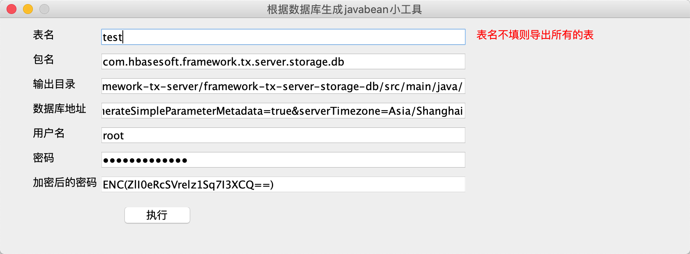

### 特性

* O/R mapping不用设置xml，零配置便于维护
* 不需要了解JDBC的知识
* SQL语句和java代码的分离
* 可以自动生成SQL语句
* 接口和实现分离，不用写持久层代码，用户只需写接口，以及某些接口方法对应的sql 它会通过动态代理自动生成实现类
* 支持自动事务处理和手动事务处理
* 整合了Hibernate+mybatis的两大优势，支持实体维护和SQL分离
* SQL支持脚本语言
* 可以无缝集成Hibernate、Spring等第三方框架，也可以单独部署运行，适应性强。

### 快速上手

1、 项目的pom.xml中引入maven配置

```
<dependency>
	<groupId>com.hbasesoft.framework</groupId>
	<artifactId>framework-db-sh</artifactId>
	<version>${framework.version}</version>
</dependency>
```

2、在application.yml中配置数据源

```
master: #主数据库配置
 db:
  type: mysql # 数据库类型，支持oracle、h2、mysql 等等， 底层用Hibernate，其支持的改框架都支持
  url: jdbc:mysql://192.168.1.1:3306/member?useUnicode=true&characterEncoding=UTF-8&generateSimpleParameterMetadata=true&serverTimezone=Asia/Shanghai
  username: test # 用户名
  password: sgp # 密码，支持加密模式，密文需要用ENC(密文)包裹
```

3、具体使用参考下面的章节

### PO (persistent object)的生成

db框架底层使用的Hibernate实现的，所以PO的规则和Hibernate保持一致， 可以使用第三方工具生成，我们也提供一个工具直接可以根据数据库中的表生成PO和DAO(Data Access Object)。 


1. 直接运行com.hbasesoft.framework.db.core.utils.DBTable2JavaBean类中的main方法，会打开一个UI界面。
2.  填写需要生成转化的表名称（不填会查询数据库中所有的表）
3.  配置数据库的连接地址和用户名密码
4.  点击生成
4.  该工具最后还提供了密码加密工具，可以用于application.yml中数据源的密码加密

### 单表的增删改查

生成好的DAO会继承 com.hbasesoft.framework.db.hibernate.IBaseDao<T> ，里面提供了大量的单表操作方法，当然如果不想使用这些方法，也可以不继承这个接口。

IBaseDao.java

```
public interface IBaseDao<T extends BaseEntity> {
	Serializable save(T entity); // 保存PO
	void saveBatch(List<T> entitys); // 批量保存PO， 最大数量为1000，超过需要使用executeBatch方法
	void update(T pojo);  // 更新PO
	int updateBySql(String sql); // 执行SQL
	void updateBatch(List<T> entitys); // 批量更新PO，最大数量为1000
	void delete(T entity); // 删除PO
	void deleteById(Serializable id); // 根据ID 删除PO
	void delete(Collection<T> entities);  // 批量删除
	void deleteByIds(Collection<? extends Serializable> ids); // 根据ID集合批量删除
	T get(Serializable id); // 根据主键做查询
	T getByProperty(String propertyName, Object value); // 根据某个唯一属性做查询
	T getByCriteria(DetachedCriteria detachedCriteria); // 根据DetachedCriteria 做唯一查询
	T getByHql(String hql); // 根据HQL做查询
	List<T> queryAll(); // 查询表中所有数据
	List<T> queryByProperty(String propertyName, Object value); // 根据某个属性做批量查询
	PagerList<T> queryPagerByCriteria(DetachedCriteria detachedCriteria, int pageIndex, int pageSize); // 根据DetachedCriteria做批量分页查询
	List<T> queryByCriteria(DetachedCriteria detachedCriteria); // 根据DetachedCriteria做批量查询
	List<T> executeProcedure(String procedureSql, Object... params); // 执行存储过程
	List<T> queryBySql(String sql); // 根据SQL做查询
	List<T> queryByHqlParam(String hql, Object... param); // HQL查询
	List<T> queryByHql(String hql); // HQL查询
	void executeBatch(String sql, Collection<Object[]> objcts, int commitNumber); // 批量执行SQL
	void clear(); // Hibernate清除缓存
	void flush(); // Hibernate将缓存内容强制写入数据库
}
```

ICourseDao.java

```
@Dao
public interface ICourseDao extends IBaseDao<CourseEntity> {
}
```

BaseDaoTester.java

```
/** 依赖spring 注入DAO */
@Resource
private ICourseDao iCourseDao;

/** 根据某个属性查询 */
@Test
public void getByProperty() {
      CourseEntity entity = iCourseDao.getByProperty(CourseEntity.COURSE_NAME, "语文");
      Assert.equals(entity.getId(), "1", ErrorCodeDef.SYSTEM_ERROR_10001);
}

 /** 根据条件做查询*/
@Test
public void getByCriteria() {
        DetachedCriteria criteria = DetachedCriteria.forClass(CourseEntity.class);
        criteria.add(Restrictions.eq(CourseEntity.COURSE_NAME, "语文"));
        CourseEntity e1 = iCourseDao.getByCriteria(criteria);

        CourseEntity e2 = iCourseDao.getByProperty(CourseEntity.COURSE_NAME, "语文");

        Assert.equals(e1.getId(), e2.getId(), ErrorCodeDef.SYSTEM_ERROR_10001);
}
```
### 复杂SQL查询及分页


### 事务控制

框架支持手动和Spring注解两种方式来控制事务
1、 Spring 注解方式

```
/*
* 该注解可以打在方法上,也可以打在类上
*/
@Transactional(isolation=Isolation.REPEATABLE_READ,propagation=Propagation.REQUIRED,readOnly=false)
public void transfer(final Integer from, final Integer to, final Float money) {
	accountDao.subMoney(from,money);
	int i = 1/0;
	accountDao.addMoney(to,money);
}
```

2、 手动控制

```
// 初始化事务定义
DefaultTransactionDefinition def = new DefaultTransactionDefinition();

// 设置事务传播方式
def.setPropagationBehavior(TransactionDefinition.PROPAGATION_REQUIRED);

// 从事物管理器中获取TransactionManager， 并获取TransactionStatus
TransactionStatus status = TransactionManagerHolder.getTransactionManager().getTransaction(def)

try {
    // TODO: 执行业务代码
    
    // 提交当前事务
    TransactionManagerHolder.getTransactionManager().commit(status);

} catch(Exception e) {
     TransactionManagerHolder.getTransactionManager().rollback(status);
}
```

### 批量数据处理

### 多数据库源

### 配置参数说明


