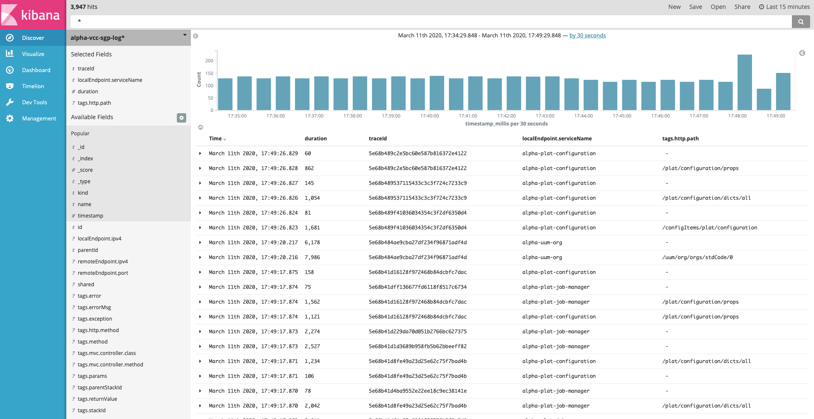

### 特性

*  集成简单上手块
*  支持全流程日志输出，有上下文跟踪，能快速排查问题
*  支持多种存储方式，可以根据项目特性需要进行选择
*  于spring-cloud-starter-sleuth集成，支持跨模块日志跟踪
*  可以与zipkin、kibana集成，功能强大
*  扩展方便，很容易集成其他的日志采集功能

### 快速上手

1、在pom.xml中引入模块

```
<dependency>
	<groupId>com.hbasesoft.framework</groupId>
	<artifactId>framework-log-file</artifactId>
	<version>${framework.version}</version>
</dependency>
```

2、配置logback.xml

```
<!-- Appender to log to file in a JSON format -->
	<appender name="transAppender"
		class="ch.qos.logback.core.rolling.RollingFileAppender">
		<file>${LOG_FILE}/trans.json</file>
		<rollingPolicy class="ch.qos.logback.core.rolling.TimeBasedRollingPolicy">
			<fileNamePattern>${LOG_FILE}/trans.json.%d{yyyy-MM-dd}.gz
			</fileNamePattern>
		</rollingPolicy>
		<encoder
			class="net.logstash.logback.encoder.LoggingEventCompositeJsonEncoder">
			<providers>
				<timestamp>
					<timeZone>UTC</timeZone>
				</timestamp>
				<pattern>
					<pattern>
						{
						"severity": "%level",
						"service": "${springAppName:-}",
						"trace": "%X{X-B3-TraceId:-}",
						"span": "%X{X-B3-SpanId:-}",
						"exportable": "%X{X-Span-Export:-}",
						"pid": "${PID:-}",
						"thread": "%thread",
						"stackId": "%X{stackId:-}",
						"parentStackId": "%X{parentStackId:-}",
						"method": "%X{method:-}",
						"params": "%X{params:-}",
						"returnValue": "%X{returnValue:-}",
						"consumeTime": "%X{consumeTime:-}",
						"exception": "%X{exception:-}",
						"rest": "%message"
						}
					</pattern>
				</pattern>
			</providers>
		</encoder>
	</appender>
	
	<logger name="com.hbasesoft.framework.log.file.TransLoggerService4File"
		level="INFO" additivity="false">
		<appender-ref ref="transAppender" />
	</logger>
```

###  采集后的日志存储进Kafka

我们支持与Spring cloud zipkin进行集成，生产环境日志采集好后，存储进kafka，在由zipkin存储进elasticsearch， 这样就可以使用kibana和zipkin在线查询项目日志。

1、 在pom中引入集成framework-log-kafka模块

```
<dependency>
	<groupId>com.hbasesoft.framework</groupId>
	<artifactId>framework-log-kafka</artifactId>
	<version>${framework.version}</version>
</dependency>
```

2、 配置项目的application.yml 增加kafka的配置

```
spring: #应用配置
  application:
    name: ${project.name}
  zipkin:
    sender:
      type: kafka
    kafka:
      service:
        name: ${project.name}
  sleuth:
    traceId128: true
    sampler:
      probability: 1.0
  kafka:  # spring kafka 配置
    bootstrap-servers: 172.16.88.58:9092,172.16.88.57:9092,172.16.88.59:9092
```

在kibana里面做信息查询


在zipkin里面做信息查询


### 配置参数说明
