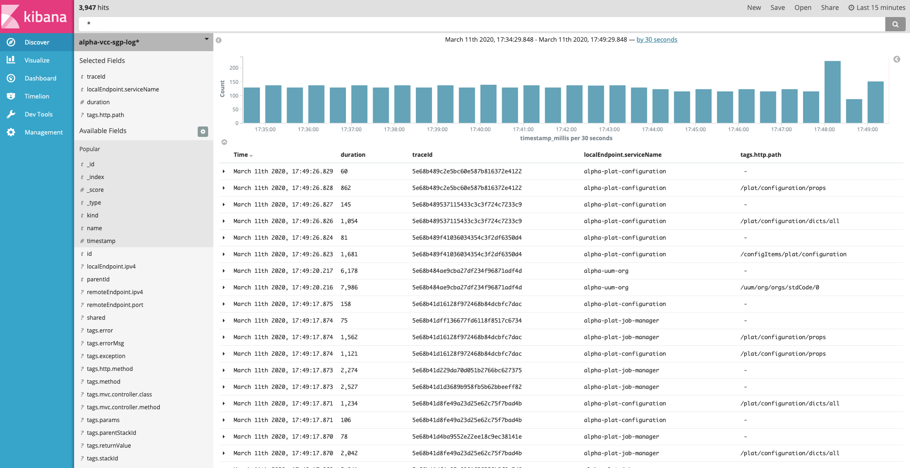
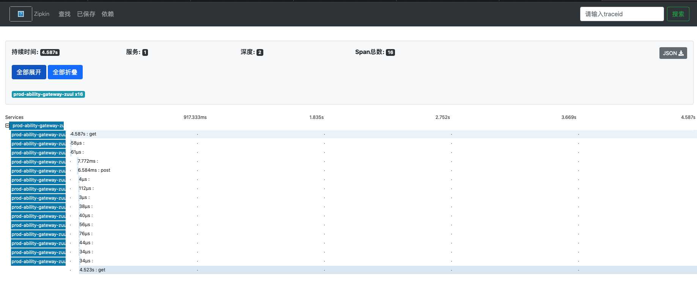

### 特性

*  集成简单上手块
*  支持全流程日志输出，有上下文跟踪，能快速排查问题
*  支持多种存储方式，可以根据项目特性需要进行选择
*  于spring-cloud-starter-sleuth集成，支持跨模块日志跟踪
*  可以与zipkin、kibana集成，功能强大
*  扩展方便，很容易集成其他的日志采集功能

### 快速上手

1、在pom.xml中引入模块

```
<dependency>
	<groupId>com.hbasesoft.framework</groupId>
	<artifactId>framework-log-file</artifactId>
	<version>${framework.version}</version>
</dependency>
```

2、配置logback.xml

```
<!-- Appender to log to file in a JSON format -->
	<appender name="transAppender"
		class="ch.qos.logback.core.rolling.RollingFileAppender">
		<file>${LOG_FILE}/trans.json</file>
		<rollingPolicy
			class="ch.qos.logback.core.rolling.SizeAndTimeBasedRollingPolicy">
			<!--日志文件输出的文件名 -->
			<fileNamePattern>${LOG_FILE}/trans.json.%d{yyyy-MM-dd}.%i.gz
			</fileNamePattern>
			<!--日志大小 -->
			<maxFileSize>${MAX_FIILE_SIZE}</maxFileSize>
			<!--日志保留时长 -->
			<maxHistory>${maxHistory}</maxHistory>
			<totalSizeCap>${totalSizeCap}</totalSizeCap>
			<cleanHistoryOnStart>true</cleanHistoryOnStart>
		</rollingPolicy>
		<encoder>
			<pattern>%m%n</pattern>
			<charset>utf8</charset>
		</encoder>
	</appender>
```
3、 配置项目的application.yml 增加spring sleuth的配置

```
spring: #应用配置
  application:
    name: ${project.name}
  sleuth:
    traceId128: true
    sampler:
      probability: 1.0
```

###  采集后的日志存储进Kafka

我们支持与Spring cloud zipkin进行集成，生产环境日志采集好后，存储进kafka，在由zipkin存储进elasticsearch， 这样就可以使用kibana和zipkin在线查询项目日志。

1、 在pom中引入集成framework-log-kafka模块

```
<dependency>
	<groupId>com.hbasesoft.framework</groupId>
	<artifactId>framework-log-kafka</artifactId>
	<version>${framework.version}</version>
</dependency>
```

2、 配置项目的application.yml 增加kafka的配置

```
spring: #应用配置
  application:
    name: ${project.name}
  zipkin:
    sender:
      type: kafka
    kafka:
      service:
        name: ${project.name}
  sleuth:
    traceId128: true
    sampler:
      probability: 1.0
  kafka:  # spring kafka 配置
    bootstrap-servers: 172.16.88.58:9092,172.16.88.57:9092,172.16.88.59:9092
```

在kibana里面做信息查询


在zipkin里面做信息查询



### 配置参数说明

在项目启动时增加 @TracerLog(basePackages = 具体的包名称) 


```
@TracerLog(basePackages = "com.hbasesoft")
@ComponentScan(basePackages = "com.hbasesoft")
public class SystemApplication {
    
    public static void main(final String[] args) throws InterruptedException {
        Bootstrap.before();
        ConfigurableApplicationContext context = SpringApplication.run(SystemApplication.class, args);
        Bootstrap.after(context);
    }
}
```

如果是包含在包下面，但是又不想打印的特殊类，可以使用@NoTracerLog注解进行屏蔽，例如：
```
@NoTracerLog
public class EventInterceptor {
}
```
